# 🏋️‍♂️ TitanFit - Premium Fitness & Supplement E-Commerce Platform

[](https://react.dev/)
[](https://vitejs.dev/)
[](https://supabase.com/)
[](https://redux-toolkit.js.org/)
[](https://tailwindcss.com/)

**TitanFit** is a high-performance, premium web application designed for fitness enthusiasts. It combines a robust supplement and gym-wear e-commerce store with an interactive Calorie & Macronutrient Calculator. The application features user authentication, a live database integration, advanced state management, and smooth animations, providing a seamless experience from fitness calculations to shopping checkout.

---

## 📸 Screenshots & Demo

> 🔗 **Live Demo:** [View TitanFit Live](https://titan-fit-wine.vercel.app/)

| Home Dashboard | Mobile View | Calorie Calculator Form | Calorie Calculator Result | Search Box |
|:---:|:---:|:---:|:---:|:---:|
| 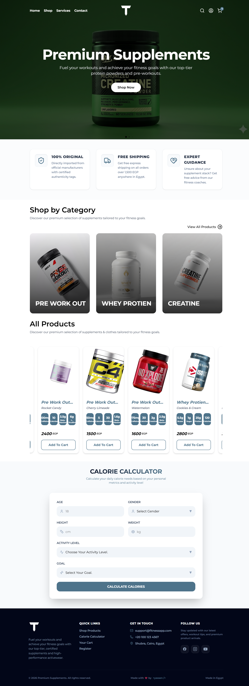 | 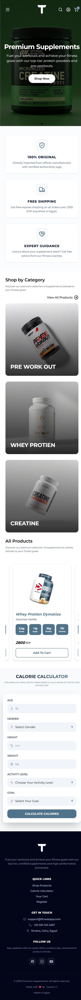 | 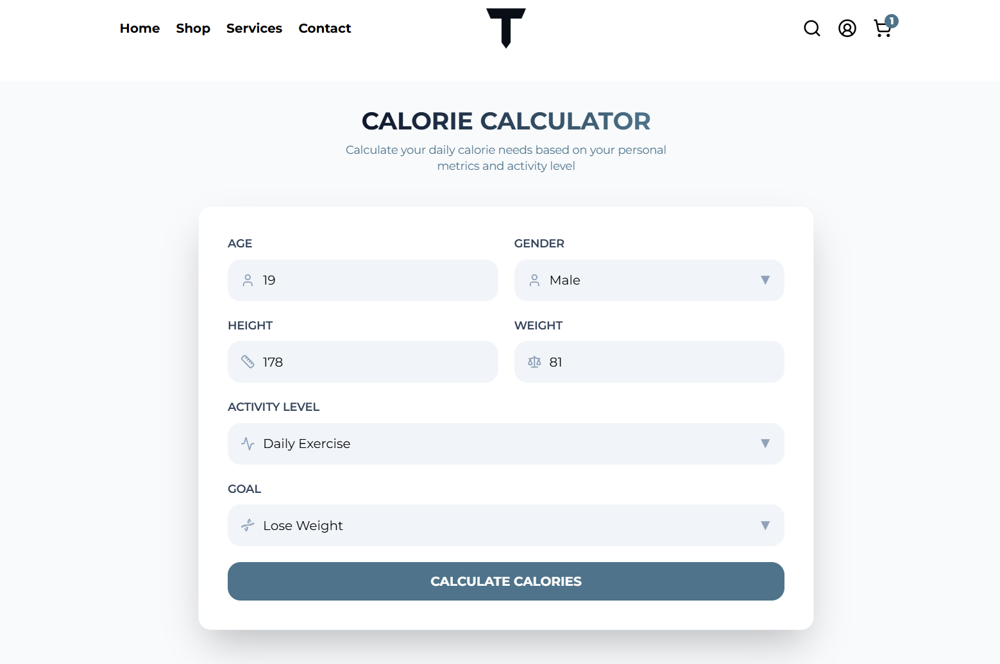 | 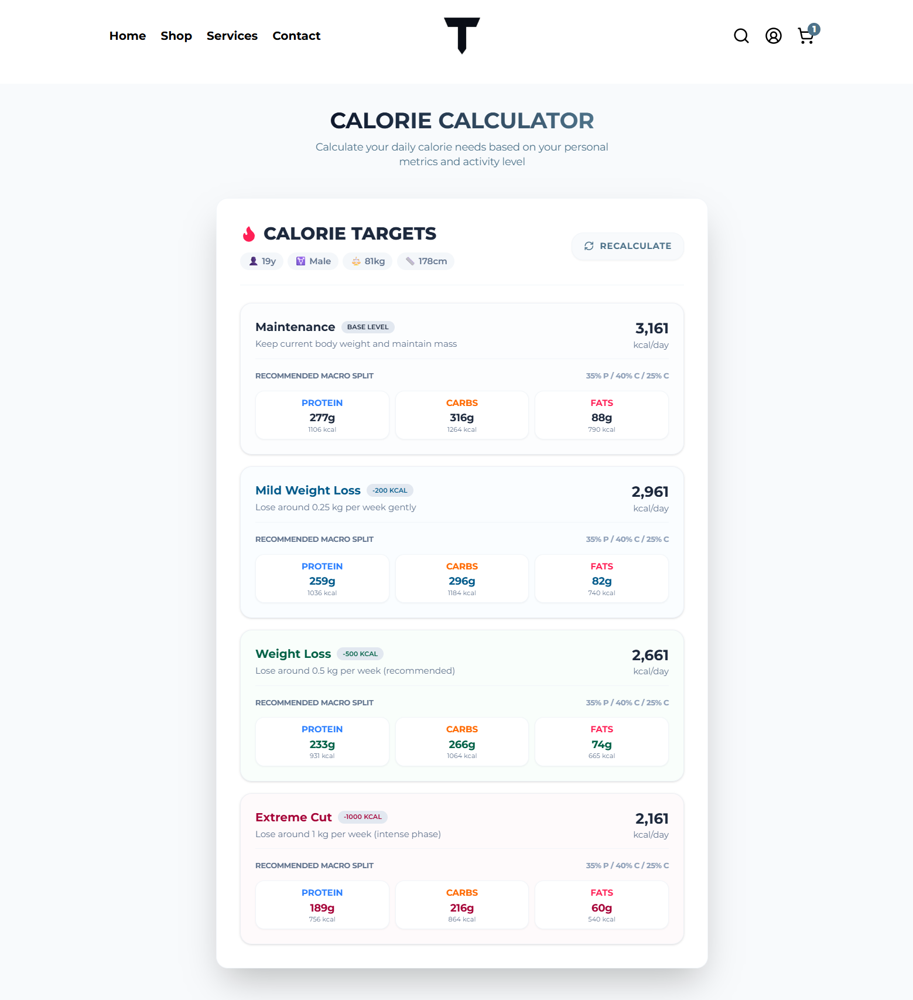 | 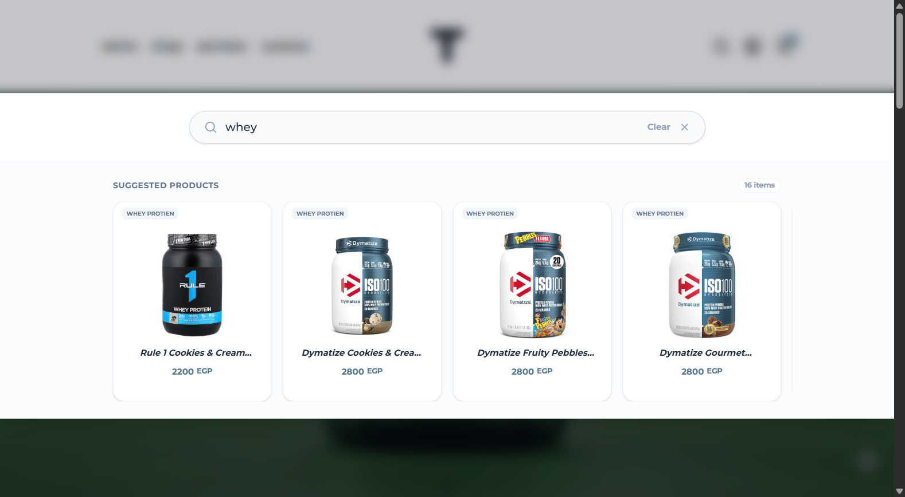

| Product Details | Shopping Cart | Checkout | User Profile | Products Category | Contact |
|:---:|:---:|:---:|:---:|:---:|:---:|
| 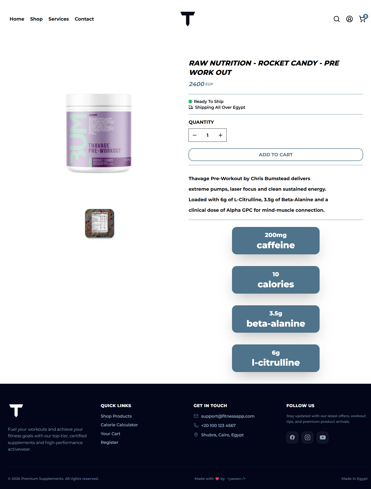 | 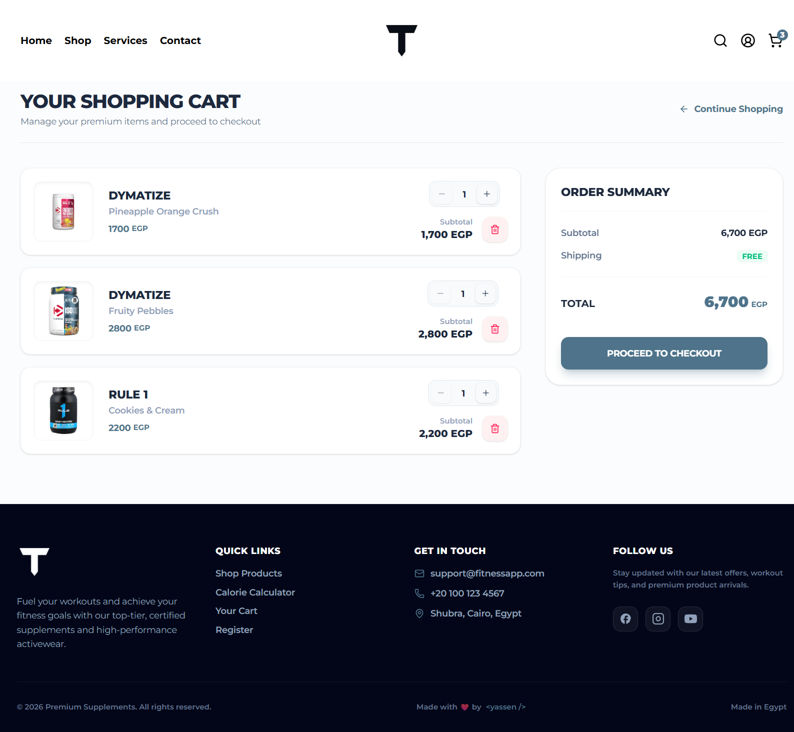 | 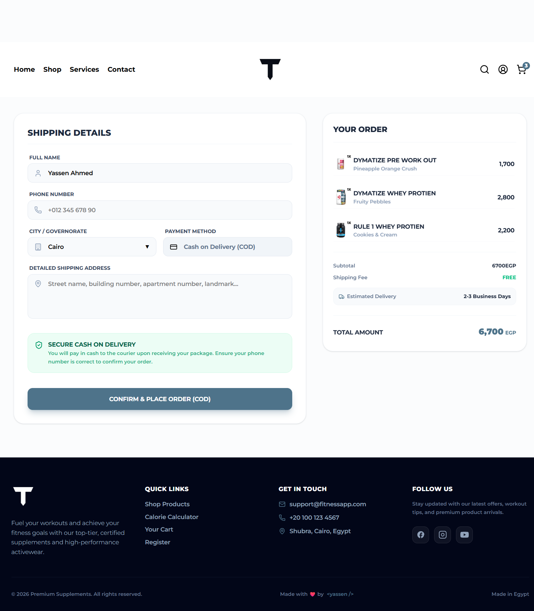 | 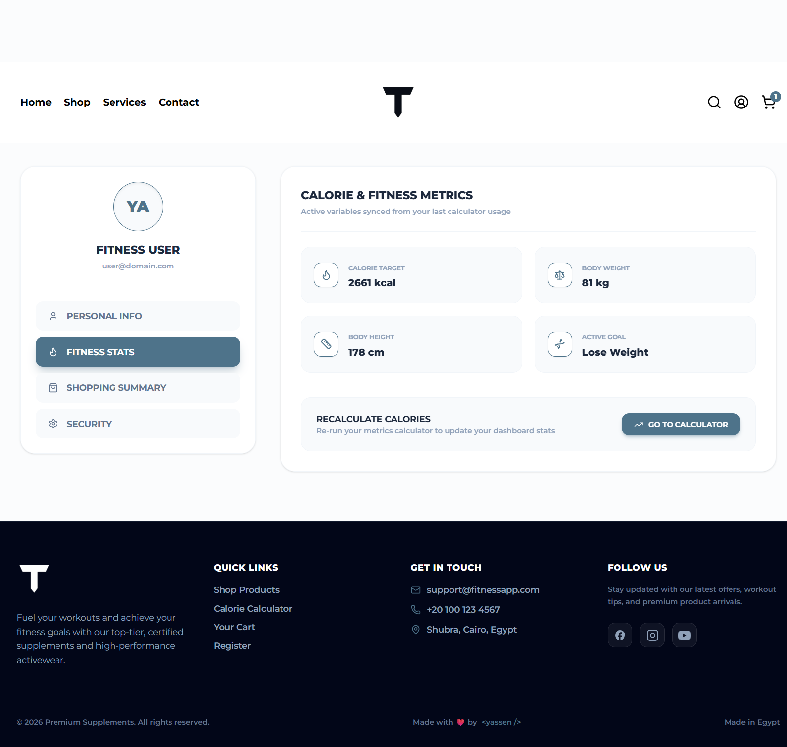 | 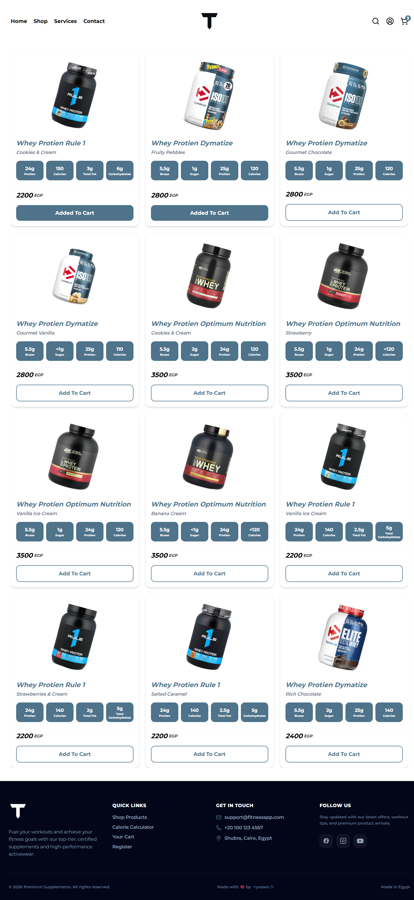 | 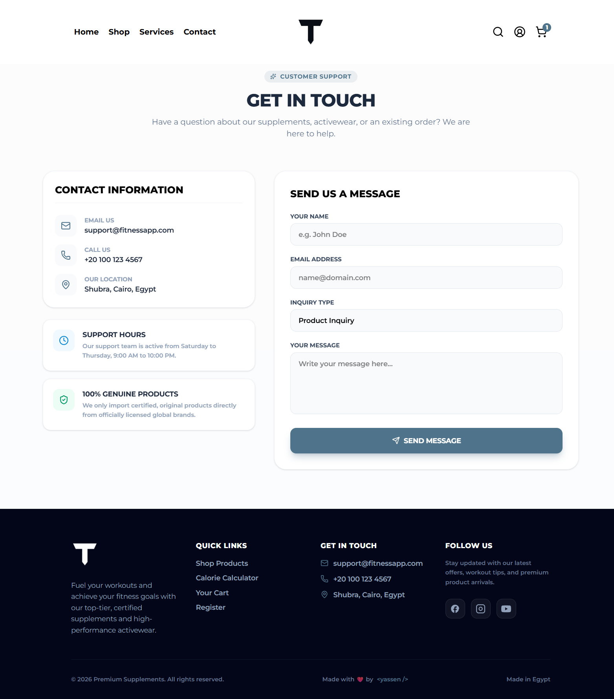 |

---

## 🚀 Key Features

### 1. 📊 Calorie & Macro Calculator
- **Custom BMR Calculations:** Calculates Basal Metabolic Rate using the user's age, gender, height, and weight.
- **Activity & Goal Adjustments:** Adjusts calorie targets based on activity level and goals (Weight Loss / Cutting or Muscle Gain / Bulking).
- **Dynamic Macro Splits:** Displays recommended daily protein, carbohydrate, and fat targets in both grams and calories.
- **Database Synchronization:** Automatically syncs fitness metrics and calculated calorie targets to the user's profile in real-time.

### 2. 🛒 Supplement Store (E-Commerce)
- **Product Catalog:** Fetches products dynamically from a database using category filters.
- **Interactive Details:** Includes a product detailed page with toggleable views between product images and nutritional facts labels.
- **Search with Debouncing:** Interactive search bar utilizing custom debounced input timeouts to limit database queries and optimize performance.
- **Redux Cart:** Cart state powered by Redux Toolkit, offering real-time quantity controls, subtotal/shipping calculations, and local storage persistence.

### 3. 🔐 User Accounts & Security (Supabase Auth)
- **Secure Authentication:** Register and login forms with password visibility toggles and regex validation.
- **Session Listener:** Listens globally to authentication state changes for smooth login/logout flows.
- **Protected Routes:** Route-level guards (`ProfileProtection` & `LoginProtection`) to protect account configuration and checkout flows.

### 4. 👤 Personal User Profile Dashboard
- **Personal Info:** Update full name and phone number dynamically.
- **Fitness Stats:** Quick dashboard showcasing metrics calculated from the calorie calculator.
- **Order History:** Visual log of previous supplement orders with progress badges (`pending` / `delivered`).
- **Security Tab:** Form to safely change passwords directly from the client application.

### 5. ⚡ Architecture & Performance Optimizations
- **Code Splitting (Lazy Loading):** Dynamically loads routes using `React.lazy` and `Suspense`, reducing the initial JS bundle size by **50%+** for faster loading times.
- **Custom React Hooks:** Separation of business logic and UI code via custom hooks (e.g., `useCheckout`, `useCalorieCalculator`).
- **Staggered Scroll Animations:** Fluid scroll-triggered animations (`ScrollReveal`) using sequential index delays.
- **Custom NotFound (404) Page:** Animated error handling page with theme-integrated styles.

---

## 🛠️ Tech Stack & Tools

- **Frontend Core:** [React 19](https://react.dev/) & [Vite](https://vitejs.dev/)
- **Routing:** [React Router Dom](https://reactrouter.com/) for single-page routing
- **State Management:** [Redux Toolkit](https://redux-toolkit.js.org/) (Cart slice) & [React Context API](https://react.dev/reference/react/createContext) (Auth provider)
- **Database & Auth:** [Supabase SDK](https://supabase.com/) (PostgreSQL & GoTrue Auth)
- **Styling:** [Tailwind CSS](https://tailwindcss.com/) for fully responsive UI layouts
- **Icons & Visuals:** [Lucide React](https://lucide.dev/) (Icons) & [React Hot Toast](https://react-hot-toast.com/) (Toast notifications)

---

## 🏗️ Architectural Highlights

### ⚡ Redux Toolkit for Cart Logic
State management for the cart utilizes Redux Toolkit slice actions (`addToCart`, `decreaseQuantity`, `removeFromCart`, `clearCart`) to enable predictable data mutations. The current cart items automatically sync with `localStorage` upon any state updates to ensure data persists across page reloads.

### 🎣 Custom Hooks Pattern
All form operations and state validations are isolated into reusable, testable React Hooks (e.g., `useCheckout` and `useCalorieCalculator`). This keeps UI components thin, declarative, and focused solely on layout.

### 🛡️ Double-Layer Guarding
1. **Frontend Router Guards:** Prevents non-authenticated users from navigating to checkout or profile views, redirects logged-in users away from auth views.
2. **Supabase RLS Policies:** Restricts table actions at the database server level, ensuring users can only read and update their own database records.

---

## 💾 Database Schema

The Postgres tables hosted on Supabase are structured as follows:

### `profiles` Table
Stores user profile information, contact details, and calculator-generated fitness metrics.
| Column | Type | Constraints | Description |
|---|---|---|---|
| `id` | `uuid` | `PRIMARY KEY`, `REFERENCES auth.users` | Maps profile record to auth user accounts |
| `fullname` | `text` | `NULLABLE` | Display name of the user |
| `email` | `text` | `UNIQUE` | User email address |
| `phone` | `text` | `NULLABLE` | Contact phone number |
| `age` | `int` | `NULLABLE` | User age |
| `weight` | `int` | `NULLABLE` | Body weight in kilograms |
| `height` | `int` | `NULLABLE` | Height in centimeters |
| `goal` | `text` | `NULLABLE` | Fitness goal (`lose` / `gain`) |
| `calories` | `int` | `NULLABLE` | Target daily calories |

### `orders` Table
Log of orders made by guest checkouts and logged-in customers.
| Column | Type | Constraints | Description |
|---|---|---|---|
| `id` | `bigint` | `PRIMARY KEY`, `GENERATED ALWAYS AS IDENTITY` | Unique order identification |
| `user_id` | `uuid` | `NULLABLE`, `REFERENCES profiles` | Null for guest checkouts |
| `guest_id` | `uuid` | `NULLABLE` | Unique ID generated for guest checkouts |
| `customer_name` | `text` | `NOT NULL` | Billing/Shipping contact name |
| `customer_phone`| `text` | `NOT NULL` | Delivery contact phone number |
| `total_price` | `numeric` | `NOT NULL` | Grand total order value |
| `order_items` | `jsonb` | `NOT NULL` | JSON array containing cart details |
| `city` | `text` | `NOT NULL` | Governorate destination |
| `address` | `text` | `NOT NULL` | Detailed shipping address |
| `status` | `text` | `DEFAULT 'pending'` | Order status (`pending` / `delivered`) |
| `created_at` | `timestamptz`| `DEFAULT now()` | Timestamp order was placed |

---

## 🎨 Design System & Styling

The UI is built using a custom responsive design system:
- **Typography:** Google Fonts Montserrat `100..900` weight range.
- **Color Palette:**
  - `maincolor`: `#4e738a` (Primary theme accent)
  - `emerald-500`: `#10b981` (Success states, delivery labels)
  - `rose-500`: `#f43f5e` (Alerts, cancel states, bulking highlights)
  - `slate-800`: `#1e293b` (Primary text headlines)
  - `slate-50`: `#f8fafc` (Muted section backgrounds)

---

## 📖 Usage Guide

- **1. Create an Account / Login:** Sign up or log in to secure your account. This is required to access your User Profile, see your synced fitness targets, and view your order history.
- **2. Calorie & Macro Calculator:** Scroll to the calculator section on the Home page. Enter your age, gender, height, weight, activity frequency, and fitness goal, then click "Calculate". Your custom daily calories and macronutrient splits will display, and if you are logged in, they will automatically sync to your dashboard!
- **3. Shopping Supplement Store:** Visit the "Shop" page or filter products by categories from the homepage. Use the search bar to find premium products dynamically. Click any product to check its detailed views (such as the toggleable image/nutrition label).
- **4. Cart & Checkout:** Add your favorite supplements to the cart, specify quantities, and proceed to the Checkout view. Fill out your delivery address and contact information to confirm your order via Cash on Delivery (COD).
- **5. Profile Management:** Go to your profile menu to review your synchronized fitness stats, view past supplement orders and tracking status, update your personal details, or change your password under security settings.

---

## ⚙️ Installation & Setup

To run **TitanFit** locally:

### 1. Clone the Repository
```bash
git clone https://github.com/yassenahmed77/TitanFit.git
cd TitanFit
```

### 2. Install Dependencies
Make sure you have [Node.js](https://nodejs.org/) installed, then run:
```bash
npm install
```

### 3. Setup Environment Variables
Create a `.env` file in the root of the project directory and add your Supabase credentials:
```env
VITE_SUPABASE_URL=your_supabase_project_url
VITE_SUPABASE_ANON_KEY=your_supabase_anon_key
```

### 4. Run Development Server
```bash
npm run dev
```
Open `http://localhost:5173` in your browser.

---

## 🔒 Supabase RLS Policies (Database Security)

Ensure Row Level Security (RLS) is enabled in your Supabase project with the following policies:

### `profiles` Table
```sql
ALTER TABLE profiles ENABLE ROW LEVEL SECURITY;

-- Allow users to read their own profile
CREATE POLICY "Allow users to read their own profile" ON profiles
FOR SELECT TO authenticated USING (auth.uid() = id);

-- Allow users to update their own profile
CREATE POLICY "Allow users to update their own profile" ON profiles
FOR UPDATE TO authenticated USING (auth.uid() = id) WITH CHECK (auth.uid() = id);
```

### `orders` Table
```sql
ALTER TABLE orders ENABLE ROW LEVEL SECURITY;

-- Allow logged in users to see their order history
CREATE POLICY "Allow users to read their own orders" ON orders
FOR SELECT TO authenticated USING (auth.uid() = user_id);

-- Allow anyone (guest & logged-in) to insert checkout orders
CREATE POLICY "Allow placing orders for anyone" ON orders
FOR INSERT TO public WITH CHECK (
  (user_id IS NOT NULL AND auth.uid() = user_id) OR (user_id IS NULL)
);
```

---

## 📞 Contact

**Yassen Ahmed**
- **GitHub:** [@yassenahmed77](https://github.com/yassenahmed77)
- **LinkedIn:** [@yassenahmed](https://www.linkedin.com/in/yassen-ahmed-dev/)
- **Gmail:** [yassennahmedd98@gmail.com](mailto:yassennahmedd98@gmail.com)
